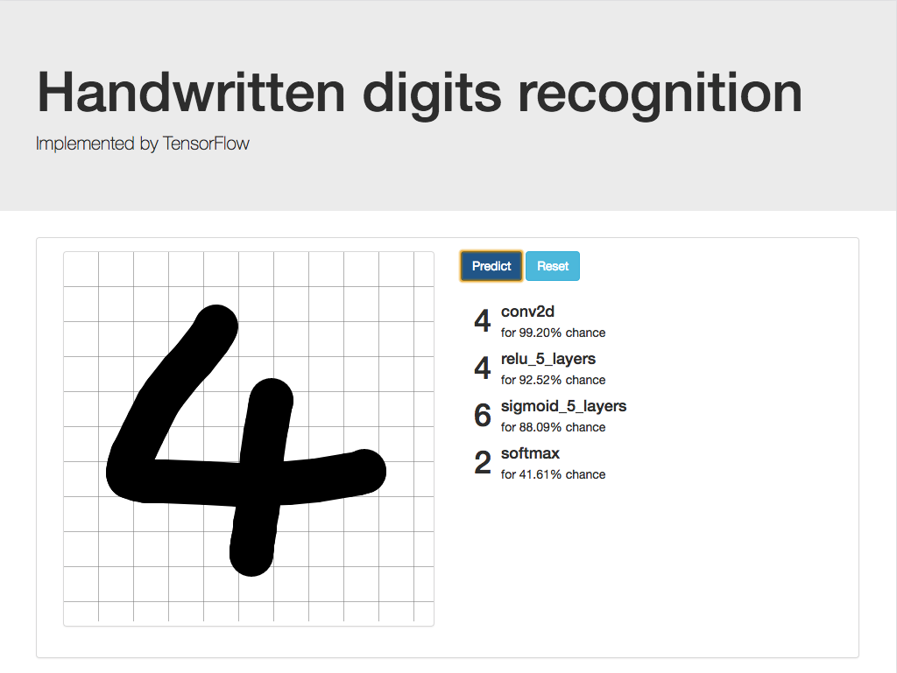

# flask-mnist-tensorflow
Handwritten digits classification from MNIST with TensorFlow

本例使用python3.6开发

本例依赖 tensorflow 1.1.0 | pillow 4.1.1

如果本例对您有帮助，请不要吝惜您的star！


## 分类器
本例训练了4中分类器：
1. 无隐藏层，激活函数为softmax

2. 5个隐藏层，激活函数为sigmoid

3. 5个隐藏层，激活函数为relu

4. 2个 卷基层+池化层，1个全连接层

   ​

## 安装依赖
`pip install -r requirements.txt`


## 运行

`python app.py`
访问 http://localhost:4000


## 训练

`python train.py`
按照如下选择需要训练的分类器
```text
Please Input the trainer:
-------------------------   
a: softmax
b: sigmoid_5_layers
c: relu_5_layers
d: conv2d
-------------------------
trainer: (a)
```


## 示例





